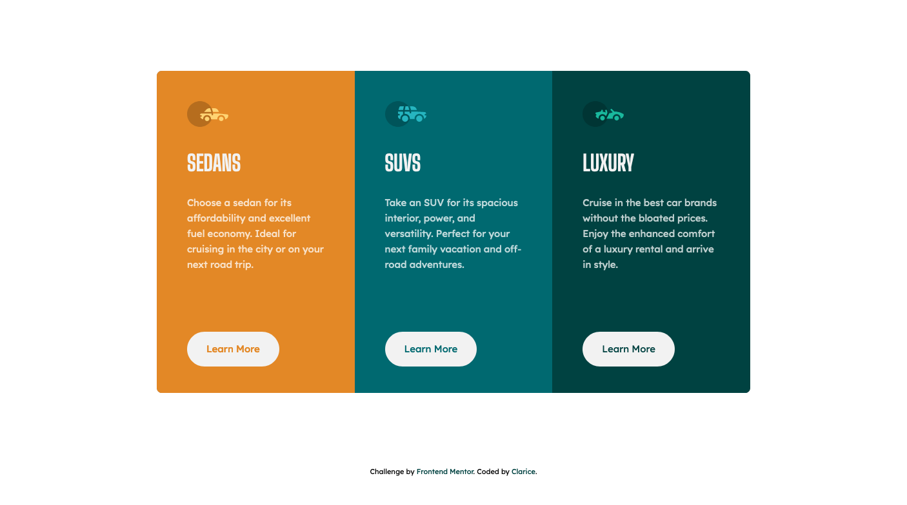

# Frontend Mentor - 3-column preview card component solution

This is a solution to the [3-column preview card component challenge on Frontend Mentor](https://www.frontendmentor.io/challenges/3column-preview-card-component-pH92eAR2-). Frontend Mentor challenges help you improve your coding skills by building realistic projects. 

## Table of contents

- [Overview](#overview)
  - [The challenge](#the-challenge)
  - [Screenshot](#screenshot)
  - [Links](#links)
- [My process](#my-process)
  - [Built with](#built-with)
  - [What I learned](#what-i-learned)
  - [Continued development](#continued-development)
  - [Useful resources](#useful-resources)
- [Author](#author)

## Overview

### The challenge

Users should be able to:

- View the optimal layout depending on their device's screen size
- See hover states for interactive elements

### Screenshot



### Links

- Solution URL: [My solution](https://www.frontendmentor.io/solutions/mobile-first-using-css-grid-layout-VIWFwShXH)
- Live Site URL: [Live site](https://claricer.github.io/three-column-card-component/)

## My process

### Built with

- Semantic HTML5 markup
- CSS custom properties
- Flexbox
- CSS Grid
- Mobile-first workflow

### What I learned

This was another challenge where I could see that grid is better for layout and flexbox is good for details. As an example, I wanted to make the buttons align at the bottom, but I didn't want to distibute the space between the rest of the content. I learned this really cool trick to do just that:

```css
.column__btn {
  margin-block-start: auto;
}
```


### Continued development

I used something like BEM for this project and I find that it has a lot of advantages. However, I also think we should be able to take advantage of the cascading when that makes things more efficient. I will be looking into finding a balance between the flatness of BEM and the traditional cascading of what CSS is.


### Useful resources

- [Learning Grid & Flexbox with Chris Coyier & Kyle Simpson](https://www.youtube.com/watch?v=rmFINtH5PNE) - This was were I learned about margin-block-start: auto.
- [CSS Grid Course](https://www.youtube.com/watch?v=T-slCsOrLcc&list=PLu8EoSxDXHP5CIFvt9-ze3IngcdAc2xKG) - Great for practicing css grid.

## Author

- Website - [Clarice](https://github.com/ClariceR)
- Frontend Mentor - [@ClariceR](https://www.frontendmentor.io/profile/ClariceR)
- Twitter - [@clari_ce_r](https://twitter.com/clari_ce_r)

